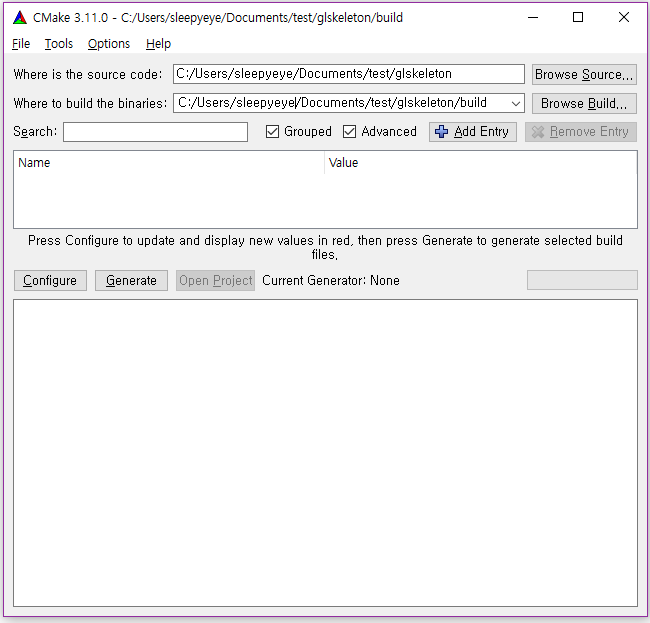
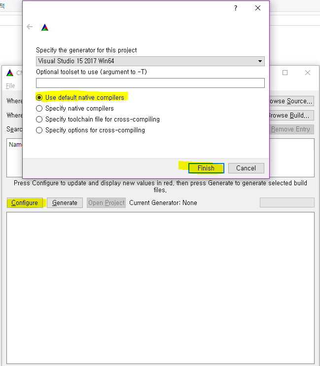
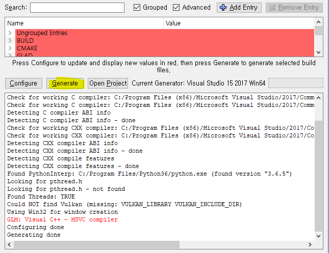

# glskeleton

This is template OpenGL cmake project for project for [computer graphics course](https://cglab.gist.ac.kr/courses.html) in gist.

Due to the scope of the lecture, the OpenGL version is intentionally set to *3.1*.


# Dependancies

You should install CMake and Git on your system.
Other libraries will be installed automatically.
- CMake, [Install it your self](https://cmake.org/download/)
- Git, [Install it your self](https://git-scm.com/downloads)
- [glfw](https://github.com/glfw/glfw.git) , Windowing library 
- [glad](https://github.com/Dav1dde/glad.git), OpenGL function loading library
- [glm](https://github.com/g-truc/glm.git), Math library for OpenGL and GLSL shader
- [tinyobjloader](https://github.com/syoyo/tinyobjloader.git), Minimal Wavefront .obj file loading library
- [python](https://www.python.org/downloads/), Python(GLAD) use python to load opengl functions


# Installation

Use git recursive clone to download the template.

You should use **Your link** in your repository.
```sh
git clone --recursive https://github.com/YOUR-ASSIGNMENT-REPO/glskeleton.git
```


# Build

## For *windows* user

1. Create build folder in project root


2. Run cmake gui(Configure and Generate)

You need to re-run cmake whenever you add more source files (\*.h, \*.cpp)
See more deatil about this at [here](#add-more-source-files).


3. Set path for build and source folder
  

Set source code directory to *project-root*.

Set build directory to *project-root/build*.

4. Configure

  

5. Generate

  

3. Build the project

  1. Go to build folder
  2. Open *glSkeleton.sln* file
  3. Make *glSkeleton* as startup project and build it


After the build process you will get directory structure like this.
```
.
├── build 
│   ├── CMakeFiles
│   ├── bin                                                # you can find your executable here
│   ├── extern
│   ├── lib                                                # you can find your static libraries
│   ├── src
│   └── glskeleton.sln                                     # your project file
├── extern                                                 # external projects
│   ├── CMakeLists.txt                                     # DO NOT TOUCH THIS
│   ├── glad
│   ├── glm
│   └── tinyobjloader
├── doc                                                    # your report/report template
└── src                                                    # your source code
    └── CMakeLists.txt
└── CMakeLists.txt
12 directories
```


## For *linux* user


1. Run cmake

You need to re-run cmake command whenever you add more source files (\*.h, \*.cpp)
See more deatil about this at [here](#add-more-source-files).
```sh
cd <PROJECT_ROOT>
mkdir build
cd build
cmake ..
```

2. Build and compile

```sh
make -j4
```


After the build process you will get directory structure like this.
```
.
├── build 
│   ├── CMakeFiles
│   ├── bin                                                # you can find your executable here
│   ├── extern
│   ├── lib                                                # you can find your static libraries
│   └── src
├── extern                                                 # external projects
│   ├── CMakeLists.txt                                     # DO NOT TOUCH THIS
│   ├── glad
│   ├── glm
│   └── tinyobjloader
├── doc                                                    # your report/report template
└── src                                                    # your source code
    └── CMakeLists.txt
└── CMakeLists.txt
12 directories
```


# How to

## Add more source files

If you want to add more sources to build your executable, see following instruction

1. Open the *CMakeLists.txt* in src folder
2. Add your sources (headers(*.h) or sources(*.cpp))

```cmake
add_executable(glskeleton
  main.cpp
  ...
  your_source_file.h
  your_source_file.cpp
  ...
  )
```

3. Rerun cmake (See [here](#build) for details)

## Change the project name

1. Open the *CMakeLists.txt* in project root
2. Change the string in project function

```cmake
project(glskeleton)                                          # Change this
```

## Change the executable name


1. Open the *CMakeLists.txt* in src folder
2. Change the *glskeleton* to 

```cmake
add_executable(glskeleton                                   # Change this word
  main.cpp
  ...
  )
```


## Submodule init and update


If you didn't use recursive option when you cloned the repo, you should init and update submodules by following commands.
```sh
git submodule init
git submodule update
```

## use higher version of OpenGL


_WARNING, if you are taking our course, you should not change the OpenGL version_

Go to *src/main.cpp*.
Edit following lines.

Original
```c++
    glfwWindowHint(GLFW_CONTEXT_VERSION_MAJOR, 3);
    glfwWindowHint(GLFW_CONTEXT_VERSION_MINOR, 1);
    glfwWindowHint(GLFW_OPENGL_PROFILE, GLFW_OPENGL_ANY_PROFILE);
```

OpenGL 4.5 with core profile
```c++
    glfwWindowHint(GLFW_CONTEXT_VERSION_MAJOR, 4);
    glfwWindowHint(GLFW_CONTEXT_VERSION_MINOR, 5);
    glfwWindowHint(GLFW_OPENGL_PROFILE, GLFW_OPENGL_CORE_PROFILE);
```
