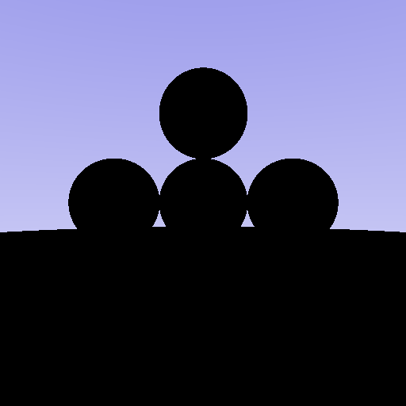
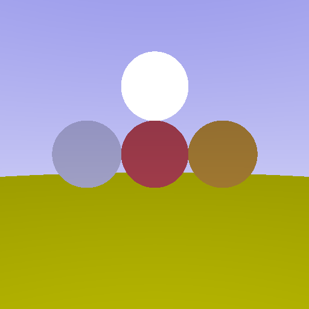
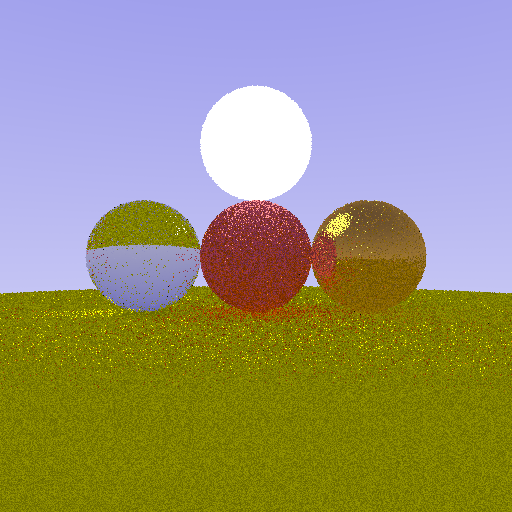
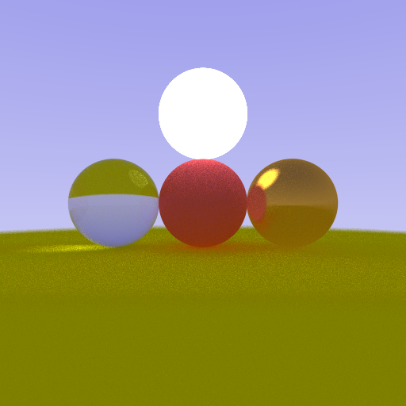
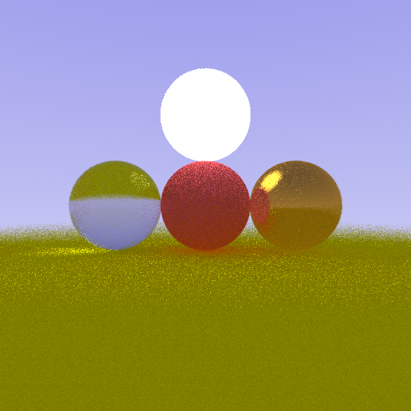
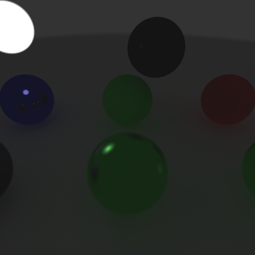
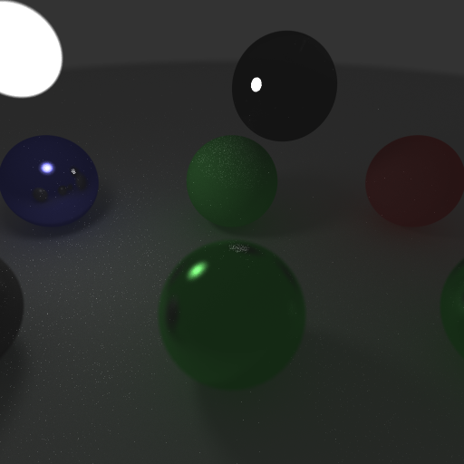

# Programming Assignment 4 - Ray Tracing


## Student Information

 + Student Name: Donghyeon Lee

 + Student ID: 20191046

 + Github id: jgs03177


## Specifications

 1. Materials (10 Points)

 1. Indirect lighting (5 Points)
 
 1. Antialiasing (5 Points)
 
 1. Defocus blur (5 Points)
 
 1. Direct light sampling (5 Points)
 
 1. Report (10 Points)


## Implementations

The order of this list is the completed time (earliest implementation first).

Below is the image created by the initial code. 




### 1. Materials

In order to differentiate the materials' property, `attenuation()` and `scatter()` function were implemented at [src/neon/material.cpp](src/neon/material.cpp).

```c++
bool Dielectric::scatter(const ne::Ray &r_in, const ne::Intersection &hit,
                         ne::Ray &r_out) const {
  r_out.o = hit.p;
  r_out.t = std::numeric_limits<float>::max();
  float ni_over_no;
  glm::vec3 normal_vector;

  float costh = glm::dot(r_in.dir, hit.n);
  if (costh < 0) {   // outside of a sphere
    ni_over_no = 1 / IOR_;
    normal_vector = hit.n;
  } else {           // inside of a sphere
    ni_over_no = IOR_;
    normal_vector = -hit.n;
    costh = -costh;
  }

  float k = 1 - ni_over_no * ni_over_no * (1 - costh * costh);
  bool refraction = false;
  // check if total reflection (k < 0)
  if (k >= 0) {
    // schlick approximation
	// cos_proj = -costh
    float coeff = 1 + costh;
    float coeff_p5 = coeff * coeff * coeff * coeff * coeff;
    float Rth = R0 + (1 - R0) * coeff_p5; // reflection coefficient at theta

    // refractivity = 1 - reflectivity (consider as probability)
    float random_scalar = glm::linearRand(0.0f, 1.0f);
    if (Rth < random_scalar) {
      refraction = true;
    }
  }

  if (refraction) {
    // refraction
    r_out.dir = ni_over_no * (r_in.dir - normal_vector * costh) 
		        - normal_vector * glm::sqrt(k);
  } else {
	// reflection
    r_out.dir = r_in.dir - 2 * costh * normal_vector;
  }
  return true;
}

bool Lambertian::scatter(const ne::Ray &r_in, const ne::Intersection &hit,
                         ne::Ray &r_out) const {
  //return false;
  
  r_out.o = hit.p;
  glm::vec3 random_vector = glm::sphericalRand(1.0f);
  // flip random vector.
  random_vector *= glm::sign(glm::dot(random_vector, hit.n));
  r_out.dir = random_vector;
  return true;
}

bool Metal::scatter(const ne::Ray &r_in, const ne::Intersection &hit,
                    ne::Ray &r_out) const {
  r_out.o = hit.p;
  r_out.t = std::numeric_limits<float>::max();
  float random_scalar = glm::linearRand(0.0f, 1.0f);
  // roughness
  if (random_scalar < roughness_) {
    // lambertian
    //return false;

    glm::vec3 random_vector = glm::sphericalRand(1.0f);
    // flip random vector.
    random_vector *= glm::sign(glm::dot(random_vector, hit.n));
    r_out.dir = random_vector;
    return true;
  }
  // specular
  glm::vec2 circleconst = glm::diskRand(specular_);
  glm::vec3 out_vec = r_in.dir - 2 * glm::dot(hit.n, r_in.dir) * hit.n;
  glm::vec3 u = glm::cross(hit.n, out_vec);
  glm::vec3 v = glm::cross(out_vec, u);
  r_out.dir = glm::normalize(out_vec + glm::mat2x3(u, v) * circleconst);
  return true;
}
```

Result image before indirect lighting implementation.



Result image after indirect lighting implementation.



### 2. Indirect lighting

Rays are implemented to scatter after they hit any materials for maximum 10 times. As the ray bounces, color, `C`, decreases, and light, `L`, increases.
The implementation can be found at [src/neon/integrator.cpp](src/neon/integrator.cpp).

```c++
glm::vec3 Integrator::integrate(const ne::Ray &ray, std::shared_ptr<ne::Scene> scene) {
  glm::vec3 K{1.0f};
  glm::vec3 L{0.0f};
  glm::vec3 C{0.0f};
  ne::Ray r{ray};
  ne::Intersection hit;
  int hitcount = 0;
  bool ishit;

  // if ray hit object in scene, apply shading
  while (ishit = scene->rayIntersect(r, hit)) {
    MaterialPointer material = hit.material;
    const glm::vec3 albedo = material->attenuation();
    K = glm::min(K, albedo);
	// emit
    L += material->emitted();
    hitcount++;
    if (hitcount > 10) {
      break;
    }
    if (!material->scatter(r, hit, r)) {
      break;
    }
  }
  if (!ishit) {
    L += scene->sampleBackgroundLight(r.dir);
  }
  C.r = K.r * L.r;
  C.g = K.g * L.g;
  C.b = K.b * L.b;

  return C;
}
```


### 3. Antialiasing

Instead of 1 ray, now the program shoots multiple rays per pixel (`jitter_n * jitter_n` rays). Jittering is implemented in . `attenuation()` and `scatter()` function were implemented at [src/neon-sandbox/main.cpp](src/neon-sandbox/main.cpp).

```c++
int jitter_n = 32;

for (int i = 0; i < jitter_n; i++) {
	for (int j = 0; j < jitter_n; j++) {  
        // epsilon xy
		float ex = glm::linearRand<float>(0.0f, 1.0f);
        float ey = glm::linearRand<float>(0.0f, 1.0f);

		// jittered uv
		float ju = float(index.x * jitter_n + i + ex) / float(jitter_n * canvas.width());
        float jv = float(index.y * jitter_n + j + ey) / float(jitter_n * canvas.height());
			
        // construct ray
        ne::Ray r = camera.sample(ju, jv);

        // compute color of ray sample and then add to pixel
        ne::core::Integrator Li;
        color += Li.integrate(r, scene);
	}
}
```

Result image with `jitter_n = 32`.



### 4. Defocus blur

Defocus blur is implemented by adding random noise to the camera origin. Implementation can be found at [src/neon/camera.hpp](src/neon/camera.hpp).

```c++
  inline ne::Ray sample_with_blur(float s, float t, float blurr) const {
    glm::vec3 origin = this->origin + glm::mat2x3(u,v) * glm::diskRand(blurr);
    return ne::Ray(origin, bottomLeft + s * horizontal + t * vertical - origin);
  }
```

Result image with `jitter_n = 3` and `blurr = 0.2f`.



### 5. Direct light sampling

Now, BRDFs of the materials are implemented and direct light sampling is applied.

Implementation of direct light sampling at [src/neon/scene.cpp](src/neon/scene.cpp).
```c++
glm::vec3 Scene::sampleDirectLight(ne::Ray &ray, ne::Intersection &hit) const {
  glm::vec3 Ls_sum = glm::vec3(0.0f);
  glm::vec3 wo = -ray.dir;
  for (auto l : lights_) {
    ne::Intersection point;
    ne::Intersection inter;
    float prob = l->sample_point(point, hit);
    glm::vec3 wi(point.p - hit.p);
    glm::vec3 win = glm::normalize(wi);
    ne::Ray ray_wi(hit.p, win);
    
	// check if the ray hits light (ie hitpoint and lightpoint can see each other).
    bool visible = l->rayIntersect(ray_wi, inter);
    float t = ray_wi.t;
	for (const auto o : objects_) {
      o->rayIntersect(ray_wi, inter);
	}
	// if not, skip.
    if (ray_wi.t < t) {
      continue;
	}

    glm::vec3 Ls = l->material_->emitted();
    float brdf = hit.material->brdf(hit.n, win, wo);
    float costh1 = glm::dot(hit.n, win);
    float costh2 = glm::abs(glm::dot(point.n, -win));
    float distancesq = glm::dot(wi, wi);
    Ls_sum += brdf * Ls * costh1 * costh2 / distancesq;
    //std::cout << Ls_sum.x << Ls_sum.y << Ls_sum.z << std::endl;
  }
  
  return Ls_sum;
}
```

`brdf()` function was implemented at [src/neon/material.cpp](src/neon/material.cpp).

```c++
float Dielectric::brdf(const glm::vec3 &n, const glm::vec3 &wi,
                       const glm::vec3 &wo) const {
  float ni_over_no;
  glm::vec3 normal_vector;
  float costh = glm::dot(wi, n);
  if (costh > 0) { // outside of a sphere
    ni_over_no = 1 / IOR_;
    normal_vector = n;
  } else { // inside of a sphere
    ni_over_no = IOR_;
    normal_vector = -n;
    costh = -costh;
  }

  bool same_side = costh * glm::dot(n, wo) > 0;

  glm::vec3 wi_mirror = -wi + 2 * glm::dot(normal_vector, wi) * normal_vector;
  glm::vec3 wi_refract(0, 0, 0);

  float k = 1 - ni_over_no * ni_over_no * (1 - costh * costh);
  // Rth = Reflectivity
  float Rth = 1; // total reflection Rth=1 when k < 0
  if (k >= 0) {
    // schlick approximation
    float coeff = 1 + costh;
    float coeff_p5 = coeff * coeff * coeff * coeff * coeff;
    Rth = R0 + (1 - R0) * coeff_p5; // reflection coefficient at theta

    glm::vec3 wi_refract = ni_over_no * (-wi + normal_vector * costh) -
                           normal_vector * glm::sqrt(k);
  }

  float reflection_specular = 0;
  float refraction_specular = 0;
  // reflection
  if (same_side) {
    float costh = glm::dot(wo, wi_mirror);
    float tanth = glm::sqrt(1 - costh * costh) / costh;
    // specular : tan(theta) < specular_
    // specular_ in 1 degree
    float specular_ = 0.1f;
    reflection_specular = (costh > 0 && 0 < tanth && tanth < specular_)
                              ? 1 / (specular_ * specular_ * glm::pi<float>())
                              : 0;
    // refraction
  } else {
    float costh = glm::dot(wo, wi_refract);
    float tanth = glm::sqrt(1 - costh * costh) / costh;
    // specular : tan(theta) < specular_
    // specular_ in 1 degree
    float specular_ = 0.1f;
    refraction_specular = (costh > 0 && 0 < tanth && tanth < specular_)
                              ? 1 / (specular_ * specular_ * glm::pi<float>())
                              : 0;
  }
  return Rth * reflection_specular + (1 - Rth) * refraction_specular;
}

float Lambertian::brdf(const glm::vec3 &n, const glm::vec3 &wi,
                       const glm::vec3 &wo) const {
  return (glm::dot(n, wi) > 0 && glm::dot(n, wo) > 0)
             ? 2 * glm::one_over_pi<float>()
             : 0;
}

float Metal::brdf(const glm::vec3 &n, const glm::vec3 &wi,
                  const glm::vec3 &wo) const {
  if (glm::dot(n, wi) > 0 && glm::dot(n, wo) > 0) {
    glm::vec3 wi_mirror = -wi + 2 * glm::dot(n, wi) * n;
    float costh = glm::dot(wo, wi_mirror);
    float tanth = glm::sqrt(1 - costh * costh) / costh;
    float lambertian = 2 * glm::one_over_pi<float>();
    // specular : tan(theta) < specular_
    float specular = (costh > 0 && 0 < tanth && tanth < specular_)
                         ? 1 / (specular_ * specular_ * glm::pi<float>())
                         : 0;
    return roughness_ * lambertian + (1 - roughness_) * specular;
  } else {
    return 0;
  }
}
```

`Integrate()` function was modified at [src/neon/integrator.cpp](src/neon/integrator.cpp).

```c++
glm::vec3 Integrator::integrate2(const ne::Ray &ray,
                                std::shared_ptr<ne::Scene> scene) {
  glm::vec3 K{1.0f};
  glm::vec3 L{0.0f};
  glm::vec3 C{0.0f};
  ne::Ray r{ray};
  ne::Intersection hit;
  int hitcount = 0;
  bool ishit;

  // if ray hit object in scene, apply shading
  while (ishit = scene->rayIntersect(r, hit)) {
    MaterialPointer material = hit.material;
    const glm::vec3 albedo = material->attenuation();
    K = glm::min(K, albedo);
    // emit
    L += material->emitted();
	L += scene->sampleDirectLight(r, hit);
    hitcount++;
    if (hitcount > 10) {
      break;
    }
    if (!material->scatter(r, hit, r)) {
      break;
    }
  }
  if (!ishit) {
    L += scene->sampleBackgroundLight2(r.dir);
  }
  C.r = K.r * L.r;
  C.g = K.g * L.g;
  C.b = K.b * L.b;

  return C;
}
```

Result image without direct light sampling (`integrate()`).



Result image with direct light sampling (`integrate2()`).


